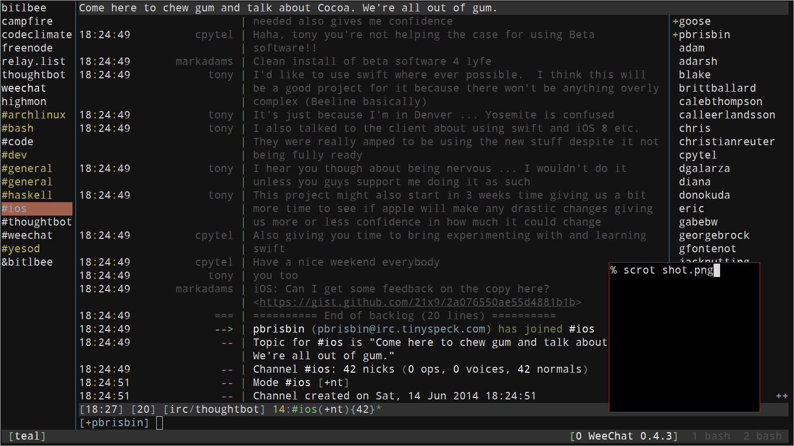

# Slacklog

Pull [Slack][] chat history in when opening a new buffer.

[slack]: https://slack.com/



## Usage

*This script is very Alpha, and not yet released.*

To try it out:

```
% git clone https://github.com/pbrisbin/weechat-slacklog
% cd slacklog
% bundle
% bundle exec rake build
% cp ./slacklog.rb ~/.weechat/ruby/
```

```
/set plugins.var.ruby.slacklog.servers "thoughtbot"
/set plugins.var.ruby.slacklog.thoughtbot.api_token "abc-123"
/script load slacklog.rb
```

- You can enable the script for multiple servers by setting a 
  comma-separated list; that's why the `api_token` setting is 
  namespaced.
- You can find your API token [here][docs].

[docs]: https://api.slack.com/

## Known bugs

- The body has escaped HTML entities.
- Any "@-mentions" in the body appear as User IDs.
